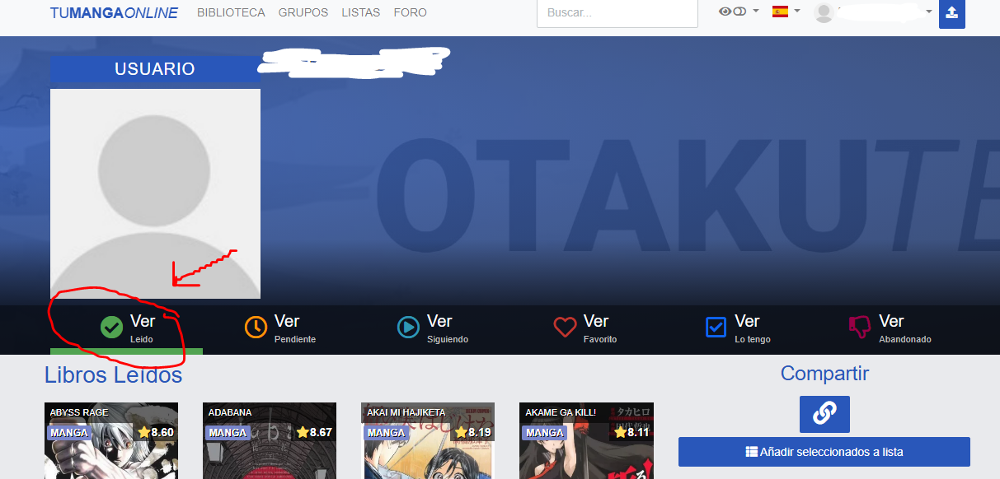
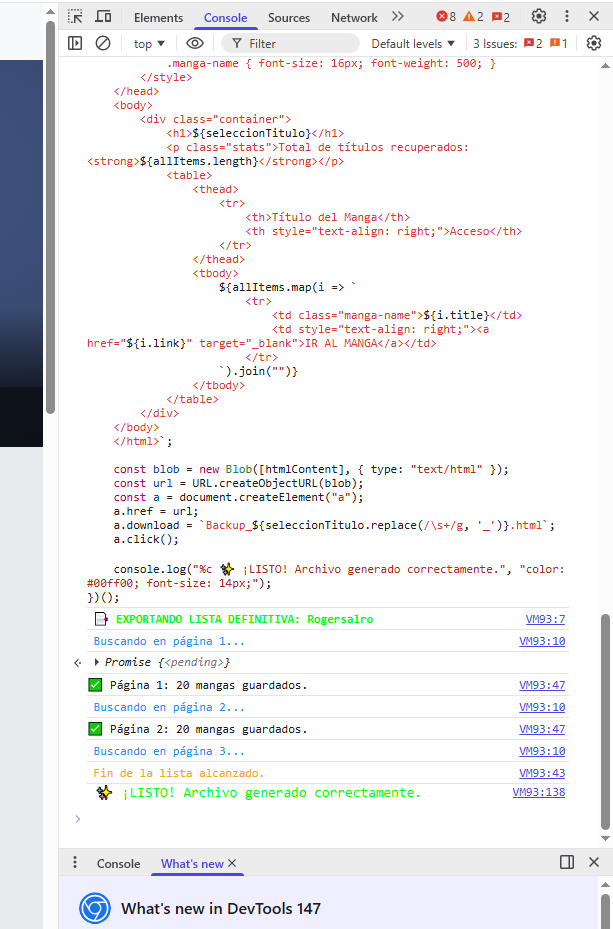

# 📦 ZonaTMO List Exporter

Este script de JavaScript permite exportar tus listas personales de manga (Leídos, Siguiendo, Pendientes, etc.) desde **ZonaTMO** a un archivo HTML limpio y organizado que puedes guardar en tu computadora.

## 🚀 Instrucciones paso a paso

### 1. Preparación
* Abre tu navegador (Chrome, Edge o Firefox) y entra en [ZonaTMO(la nueva web de momento)](https://zonatmo.nakamasweb.com/) (o tu dominio actual de TMO).
* **Inicia sesión** con tu cuenta.
* Ve a tu perfil y selecciona la lista que quieras descargar (ejemplo: "Leídos").

### 2. Abrir la Consola de Desarrollador
* Una vez dentro de la lista, presiona la tecla **F12** en tu teclado (o `Ctrl + Shift + I`).
* Se abrirá un panel lateral o inferior. Haz clic en la pestaña que dice **"Console"** (o Consola).

### 3. Ejecutar el Script
* Copia el código completo del script que te proporcioné.
* Pégalo en la consola, justo al lado del cursor azul (`>`).
* Presiona **Enter**.

> **⚠️ Nota de seguridad:** Si es la primera vez que pegas código, el navegador podría mostrarte un aviso de seguridad. Si es así, escribe `allow pasting` y pulsa Enter antes de pegar el script.

### 4. Proceso de Descarga
* Verás que la consola empieza a mostrar mensajes como: `Buscando en página 1...`, `Buscando en página 2...`.
* **No cierres la pestaña** hasta que termine.
* Al finalizar, se descargará automáticamente un archivo llamado `Backup_NombreDeTuLista.html`.

---

## 📋 Características del archivo generado
* **Diseño Dark Mode:** Fondo oscuro para una lectura cómoda.
* **Sin Imágenes Rotas:** Lista optimizada con texto y enlaces directos para evitar bloqueos del servidor.
* **Enlaces Directos:** Cada título tiene un botón para volver a abrir el manga en la web.
* **Ligero:** El archivo resultante pesa muy poco y se puede abrir en cualquier dispositivo.

## 🛠️ Notas Técnicas
* El script utiliza un **retraso de seguridad** entre páginas para evitar que el servidor de la web te bloquee temporalmente.
* Si tienes muchas páginas (más de 10), ten paciencia; el script las recorrerá todas automáticamente.
* **Privacidad:** Este código es 100% local. No envía tus datos a ningún sitio; solo lee lo que tú ya estás viendo en pantalla.

---
*Creado para respaldar colecciones de manga de forma sencilla.*